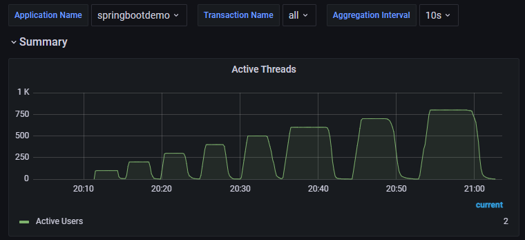
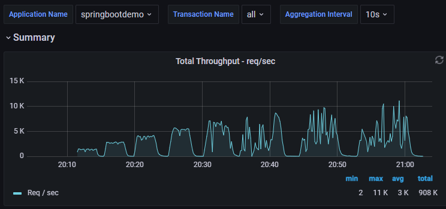
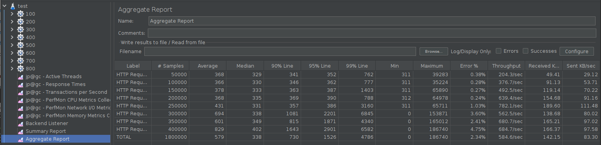
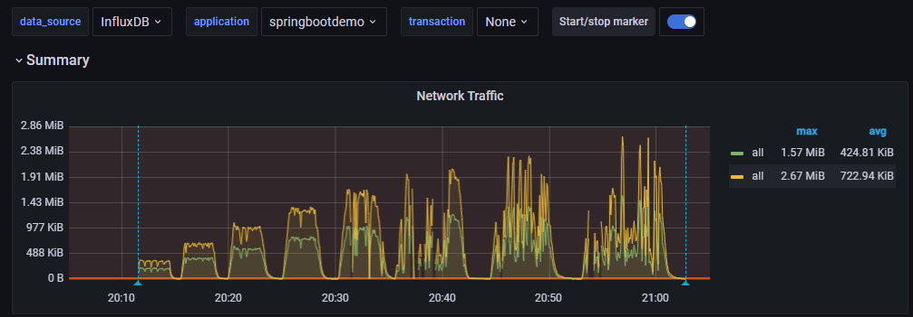
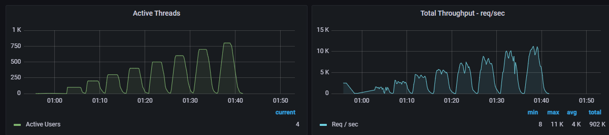
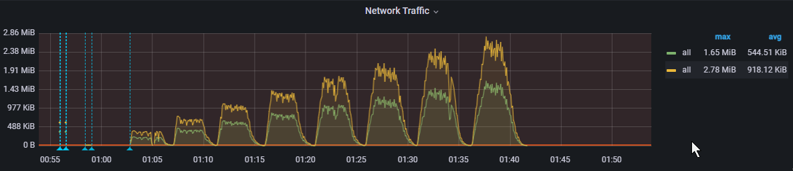
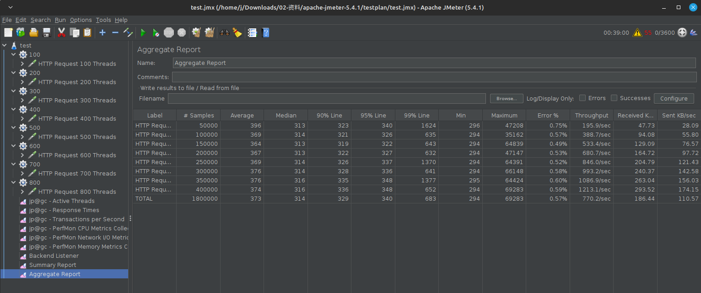

# 测试报告

## 01-测试目的

实际操作课上学到的测试方法。

## 02-测试工具

Jmeter，Grafana，Influxdb...

## 03-测试环境

### 3.1 环境

| 指标              | 参数 |
| ----------------- | ---- |
| 机器              | 4C8G |
| 集群规模          | 单机 |
| 应用              | springbootdemo  |
| 数据库            | 无 |
| 网速              | 5 Mbps |

## 04-测试场景

测试场景：验证接口在不同并发规模的表现，以及针对出现的性能瓶颈做出相应的改进

模拟高延时场景，**用户访问接口并发逐渐增加的过程。接口的响应时间为500ms，线程梯度：100、200、300、400、500、600、700、800个线程，200次; 

- 时间设置：Ramp-up period(inseconds)的值设为对应线程数的1/10；
- 测试总时长：约等于500ms x 500次 x 8 = 800s = 30分

## 05-测试

### 测试1

可以看到，当线程数达到500的时候，TPS开始出现剧烈抖动，错误率也大大增加

在聚合报告中也印证了这一点，TPS在线程数达到500后开始下降

经过排查，认为问题是带宽不够导致TPS达到瓶颈

### 测试 2

在提升了服务器的带宽之后进行了测试2

可以看到TPS有了明显的提升

