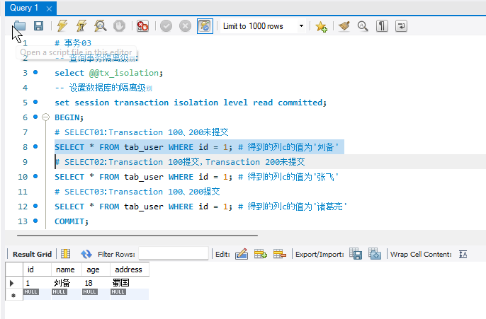
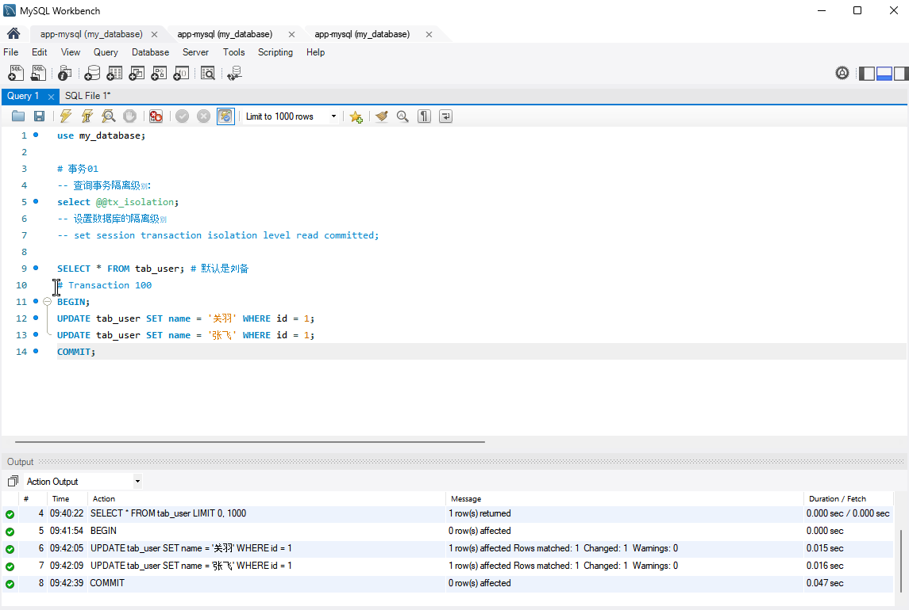

## 题目 01- 完成 ReadView 案例，解释为什么 RR 和 RC 隔离级别下看到查询结果不一致

### 要求：

    完成案例 01- 读已提交 RC 隔离级别下的可见性分析
    完成案例 02- 可重复读 RR 隔离级别下的可见性分析
    用通俗易懂的方式记录整个案例过程，可以画图与截图
    做完案例给出结论，并对结论进行分析

### 案例 01- 读已提交 RC 隔离级别下的可见性分析

#### 操作步骤

设置数据库的隔离级别为 Read Committed

开启事务01, 执行两次更新:

开启事务02, 执行第一次更新, 这时由于事务01仍未提交, 对同一数据的更新被阻塞:

开启事务03, 执行第一次查询, 得到的仍是"刘备":

提交事务01, 这时被阻塞的事务02的第一次更新被执行, 事务03的查询结果变成"张飞":

继续执行事务02的第二次更新, 在未提交事务02时, 事务03的查询结果仍是"张飞":

提交事务02, 事务03的查询结果变为"诸葛亮":

#### 结论

使用RC隔离级别的事务在每次查询开始时都会生成一个独立的ReadView, 在案例01中, 事务03总共在T6,T8,T10生成了3次ReadView. 因为事务01和事务02分别在T8和T10之前提交了自己的修改,所以3次查询的结果都不相同.

### 案例 02- 可重复读 RR 隔离级别下的可见性分析

#### 操作步骤

和案例 01几乎相同, 只是没有设置数据库隔离级别为RC, 我这里默认级别为RR

在事务01未提交之前, 事务02的操作仍然会被阻塞:

在T6, T8, T10时刻的查询结果均为刘备:

#### 结论

与RC不同, 对于使用RR隔离级别的事务来说, 只会在第一次执行查询语句时生成一个ReadView, 之后的查询就不会重复生成了. 对于案例02中的事务03来说, 它能看到的数据就是在它被创建的T6时刻的版本.

## 题目 02- 什么是索引？

一种可以帮助数据库高效获取数据,加快查询速度的数据结构.

### 优点是什么？

* 可以提高数据检索的效率, 降低数据库的IO成本.
* 可以通过索引列对数据进行排序, 降低数据排序的成本.

### 缺点是什么？

* 索引会占据磁盘空间, 在MySQL中, 每一个索引或者组合索引都会创建一个存储在磁盘上的例如B+树的数据结构.
* 索引会降低更新表的速度.

### 索引分类有哪些？特点是什么？

按照索引列的数量分类:

* 单列索引:
  * 主键索引, 即主键 Primary Key
  * 普通索引, 任意列都可以加索引
  * 唯一索引, 索引列的值必须唯一 Unique Index
  * 全文索引, 文本类型的字段长度较大时可以使用
  * 前缀索引, 对索引列的一部分进行索引
* 组合索引: 即多个单列索引的组合
    
    
### 索引创建的原则是什么？

1. 频繁出现在WHERE条件中的字段, ORDER排序, GROUP BY分组字段
2. SELECT频繁查询的列, 考虑是否需要创建联合索引以及使用覆盖索引, 这时要考虑列顺序, 索引中不同列的唯一值的数量等因素
3. 多表JOIN关联查询, ON字段两边的字段需要创建索引

### 有哪些使用索引的注意事项？

1. 表记录很少不需要创建索引
2. 一个表的索引个数不能过多
3. 频繁更新的字段不建议作为索引
4. 区分度低的字段不建议作为索引
5. InnoDB中, 主键索引建议使用自增的长整型, 避免使用很长的字段
6. 不建议用无序的值作为索引
7. 尽量创建组合索引

### 如何知道 SQL 是否用到了索引？
    
可以通过使用EXPLAIN语句来查看查询的执行计划, 从而判断是否使用到了索引以及索引的使用情况.

与索引相关的EXPLAIN语句执行结果有:

* type: 表示使用了哪种类型的索引，如 const、eq_ref、ref、range、index、ALL 等。
* possible_keys: 显示可能使用的索引。
* key: 显示实际使用的索引。
* key_len: 使用索引的长度。
* ref: 显示索引的引用列。
* rows: 预计要扫描的行数。
* Extra: 其他额外的信息，如 Using index 表示是覆盖索引，Using where 表示使用了 WHERE 条件等。
    
### 请你解释一下索引的原理是什么？「重点」

将表中的数据根据某个列值(单列索引)或一组列值(组合索引)存放在适当的数据结构(如红黑树, B+树)中的适当位置上, 从而达到加快数据查询的效果.

以B+树为例, 每个InnoDB表都有一个使用B+树构建的聚簇索引, 也即主键索引, 当一个表没有创建主键索引时, InnoDB会自动创建一个由ROWID字段构建的聚簇索引.
B+树的数据结构如下:
* B+树是对B树(Balance Tree)的进一步优化的结果, B+树是一种多叉树, 每个非叶子节点可以存储多个索引及其子节点的地址, 每个非叶子节点都存储在一个磁盘块中, 这样可以确保每个节点的读取和写入都是以块为单位进行的, 从而提高磁盘I/O的效率.
* B+树的阶数定义了每个节点中可以存储的最大索引数量, 阶数越大, 每个节点能存储的索引越多, 树的高度越小, 但阶数过大会导致每个节点的大小增加, 从而导致在内存中能够存储的节点数量减少, 同时也使插入和删除的操作效率变差. 一般来说, 阶数在几十到几百之间是常见的.
* B+树的叶子节点存储了实际的数据记录, 叶子节点之间使用双向指针链接, 最底层的叶子节点可以看作一个有序的双向链表, 这是因为在B+树的构建过程中, 数据会通过比较插入适当的位置以使得最终形成这种平衡的多叉树结构.

通过使用这种数据结构, 通常情况下, 例如非全文索引或空间索引的情况下, 等值查询和范围查询的效率都是最优的.

## 题目 03- 什么是 MVCC？

MVCC(Multiversion concurrency control): 多版本并发控制, 是RDBMS常用的一种并发控制方法. 核心思想是读不加锁, 读写不冲突. MVCC的实现原理关键在于数据快照, 不同的事物访问不同版本的数据快照, 从而实现事务对数据的隔离级别. MVCC的实现依赖Undo日志和ReadView

### Undo 日志

Undo日志原本用于数据回滚操作, 在InnoDB中, 当一个事务开始修改一行数据时, 它首先会创建一个该行数据的副本, 这个副本除了数据本身之外, 还包含一些重要信息, 比如当前事务的ID, 以及一个Roll_Pointer, 用于指向之前的副本, 从而实现了一个关于该行数据的版本链. 这个版本链与ReadView一起控制了数据的可见性, 即哪个版本的数据可以被其他事务看到.

### ReadView

ReadView 是存在于内存中的一组数据结构,用于判断被其他事务操作的数据是否可见, 以支持多版本并发控制机制, 从而实现数据库事务的隔离性.

ReadView主要包括以下几个关键组成部分:

1. m_ids: ReadView 快照生成时系统中活跃的读写事务列表. 
2. 高水位标记(high water mark, m_low_limit_id): 凡事务id大于等于该值的数据修改, 当前事务都看不到.
3. 低水位标记(low water mark, m_up_limit_id): 凡事务id小于该值的数据修改, 当前事务都应能看到.
4. m_creator_trx_id: 创建该ReadView的事务id.

### 如何判断可见性

* 如果被访问记录trx_id小于m_up_limit_id，表明ReadView创建的时候该事务已经提交，记录可见。
* 或者等于m_creator_trx_id
* 如果记录的trx_id大于等于m_low_limit_id，表明事务是在ReadView创建后开启的，其修改，插入的记录不可见。
* 当trx_id在m_up_limit_id和m_low_limit_id之间的时候: 
  * 如果id在m_ids数组中，表明ReadView创建时候，事务处于活跃状态，因此记录不可见.
  * 如果不在,说明事务已提交,因此记录可见.

