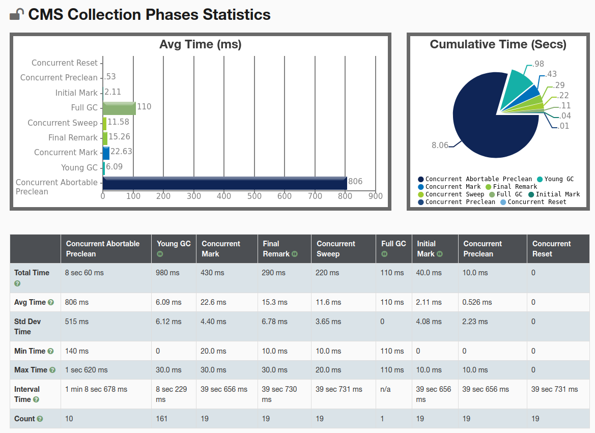

# 测试报告

## 测试环境
两台阿里云ECS，一台部署了暴露actuator接口的Spring Boot应用，另一台部署了Grafana和Prometheus

## 测试内容
在tomcat的bin文件夹中添加了setenv.sh，分三次测试三种不同的垃圾收集器组合
测试用例是一个平均响应时间约为500ms的接口，分别以100到800个线程进行梯度压测

### 测试 1 吞吐量优先策略

JVM 参数 `-XX:+UseParallelGC -XX:+UseParallelOldGC` 其余略
 
OPS & RT

JVM 堆内存

GC

### 测试 2 响应时间优先策略

JVM 参数 `-XX:+UseParNewGC -XX:+UseConcMarkSweepGC`

OPS & RT

JVM 堆内存

GC

### 测试 3 全功能垃圾收集器

JVM 参数 `-XX:+UseG1GC -XX:MaxGCPauseMillis=100`

OPS & RT

JVM 堆内存

GC

## 总结：
可能是测试用例选取的不好，我只看出测试 2 中使用的CMS确实比其它两种的暂停时间要短很多